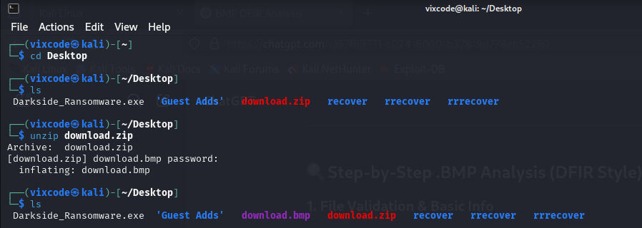

# Case Study: Static and Dynamic Analysis of a Suspicious BMP Image

## Executive summary

A Windows-targeted payload was discovered embedded within an ostensibly benign `.bmp` image. Static analysis revealed high entropy, header anomalies, and steganographic indicators; dynamic analysis in an instrumented sandbox showed attempted TCP communications to {`217}.{182.} {54}.{224}:4444` (a port commonly used by Metasploit), but the connection never completed (SYN without ACK). On present evidence, the artefact contains a latent capability but the tested sample did not achieve command-and-control (C2) during execution.

---

## Background & objectives

- **Context:** A file was received on **Tuesday, 8 April 2025 at 21:00 WAT** for malware triage and reporting.
- **Objective:** Determine whether the image contains malicious content, assess execution behaviour, and provide remediation guidance.

---

## Scope

- **In scope:** Static artefact analysis, steganography checks, controlled dynamic execution (Windows), network telemetry capture, basic infrastructure attribution.
- **Out of scope:** Full reverse engineering of shellcode, threat actor attribution beyond basic network owner/location, widespread environment sweep.

---

## Tools & artefacts

- **Static:** `exiftool`, hex viewer, entropy inspection, `zsteg`.
- **Dynamic:** FLARE VM (Windows), **Wireshark**.
- **Build/execution helper:** `csc.exe`, `NativePayload_Image.cs` extractor utility.
- **Threat intel:** VirusTotal (historical detections), basic WHOIS/ASN checks (OVH / ASN 16276).

## Methodology

first, i had to unzip it, then discovered that the file is  a .bmp this tells me it is an image.

image1: unziping the file

image2: image

Wow, very nice car.

i decided to check  the  hash value for the file.

image 3: hash value

Now, lets see what virus total have to say, concerning this hash.

the last time, this file was analysed was 4years ago amd it showed 7 flagged it as malicious.

so, i  has to reanalyze this file .

Image4: VirusTotal result

i checked the file size.

Image5: File Size

checked the metadata using exiftool

image 6: Exiftool result

nothing looks suspicious.

i analysed the  hex value

image 7a: XXD result

scrolling down, i could see that it has high entropy.  which may indicate, compressed, encoded or embedded file

went back to my terminal.

checked for a clean .bmp file so i can compare 

the headers were a bit different

Now

i  use zsteg to see the embedded data.

{60.}{71}.{62}.{73}

After Extracting doing the static analysis, its time to get more information by running a  dynamic analysis.

we have to look for a tool that can  test payloads that can hide in images, and then observe the  the traffic using wireshark.

This malware is built to run in a windows environment, so i had to use my flareVm sandbox to execute the payload in the image.

luckily, we were able to find a tool **NativePayload_Image.cs**

[NativePayload_Image Script](NativePayload_Image%20Script%201e75f18a0bc9802e89fcc03490ecebfc.md)

This Script:

- **Extracts and runs** embedded shellcode from image files (like `.bmp`)
- Implements **code injection** or memory manipulation

Compiled the C+ program to .exe

csc.exe /out:NativePayload_Image.cs.exe NativePayload_Image.cs /r:System.Drawing.dll

>>> NativePayload_Image.cs.exe bitmap download.bmp 510 54 00a8:fixme:ntddll:ntQuerySystemInformation info_class SYSTEM_PERFORMANCE_INFORMATION

next observed it through Wireshark.

Use the filter tcp.port == 4444 to filter out non metasploit  communication.

### Analysis

This Payload is Communicating to the ip {217}.{182}.{54.}{224} on port 4444, however, the Syn request didn’t get an Acknowledgment, this means the communication was not establish, therefore, the exploit didn’t fly and the threat  is not active.

This Ip is from France.

Decimal:3652597472

Hostname:217.182.54.224

ASN:16276

ISP:OVH SAS

Services:Datacenter

Country:France

State/Region:Hauts-de-France

City:Roubaix

## Key findings

1. **Malicious capability concealed in image format.** Indicators include header anomalies, high entropy, and `zsteg` hits—consistent with steganography / embedded shellcode.
2. **Intended C2 channel detected but inactive during test.** Repeated SYNs to `217.182.54.224:4444` with no ACK suggest the remote listener was down, filtered, geofenced, or otherwise unreachable at analysis time.
3. **Historical detections reinforce suspicion.** Prior multi-engine flags (7 vendors) increase confidence that the artefact or its lineage is malicious.
4. **No successful post-exploitation observed.** Without a completed connection, we saw **no process injection follow-on, no module staging, no data exfiltration**, and no persistence artefacts in the sandbox.

---

## Risk assessment

- **Likelihood (current):** **Low–Moderate** in the immediate term, given no active C2 observed in testing.
- **Impact (if activated):** **High**, due to demonstrated code-execution path and likely remote control capability (Metasploit-style staging).
- **Overall risk rating:** **Medium** (latent threat; dangerous if infrastructure becomes reachable or payload is updated).

---

## Indicators of compromise (IoCs)

- **Network:** `217.182.54.224:4444` (OVH SAS, ASN 16276, Roubaix, FR).
- **File artefact:** Suspicious BMP with header anomalies and high-entropy segments; stego-detectable content (via `zsteg`).
- **Behavioural:** Outbound SYN attempts to TCP/4444 from host post-execution of the extractor.

> Note: The exact file hash was computed during analysis but not recorded in the project text. If available in your environment, add SHA-256 to this section for enterprise blocking and retro-hunting.
> 

---

## MITRE ATT&CK® mapping (indicative)

- **T1027** — Obfuscated/Compressed Files & Information (high-entropy embedded content).
- **T1204** — User Execution (image relied upon to trigger downstream execution).
- **T1055** — Process Injection / Memory Manipulation (as suggested by the extractor’s technique).
- **T1071.001/002** — Application Layer Protocol (if C2 over TCP/4444 were established).

---

## Remediation & containment recommendations

1. **Immediate network controls**
    - **Block egress** to `217.182.54.224` and **deny TCP/4444** outbound at perimeter devices.
    - Add detections for **unexpected TCP/4444** attempts from endpoints and servers.
2. **Email & file-handling hygiene**
    - Quarantine the original BMP and any derivatives; **disallow execution** of external utilities against untrusted images on production hosts.
    - **Strip or convert** inbound images to a safe, re-encoded format (e.g., transcode to PNG/JPEG via a trusted pipeline) to neutralise stego channels.
3. **Endpoint visibility**
    - Ensure **EDR** is tuned to flag **image-launched processes**, in-memory code execution, and **shellcode patterns**.
    - Deploy a **YARA** rule (if hash or byte patterns are available) across file shares and endpoint caches.
4. **Hunt & monitor**
    - Retrospectively **hunt for egress to TCP/4444** and the listed IP across **firewall/NetFlow/DNS** logs for the past 90 days.
    - Monitor for **new outbound SYNs** to the same IP or to other likely C2 netblocks at OVH (weighted anomaly alerts).
5. **User awareness**
    - Brief relevant teams that **images can carry active payloads** and reinforce safe-handling of suspicious media.

---

## Lessons learned

- **Steganography remains practical in real campaigns.** Traditional file-type trust (“it’s just a picture”) is misplaced.
- **Dynamic results depend on live infrastructure.** Lack of C2 does not equate to safety; infrastructure may be intermittent or geo-restricted.
- **Rapid triage benefits from combined approaches.** Header/entropy checks + `zsteg` + controlled execution quickly characterised risk.

---

## Timeline of activity (WAT)

- **08 Apr 2025, 21:00** — File received and unzipped; identified as BMP.
- **08–09 Apr 2025** — Static analysis (metadata, entropy, header comparison, `zsteg`); VirusTotal historical context noted and re-scan initiated.
- **09 Apr 2025** — Payload extraction via `NativePayload_Image.cs` compiled with `csc`; dynamic run in FLARE VM; Wireshark capture shows SYNs to {`217}.{182.}{54.}{}224:{4444`} with no ACK.

## Conclusion

The analysed BMP file is **maliciously crafted** to host and execute shellcode. While no active C2 was reached during testing, the capability and intent are evident. Treat the artefact as **hostile**, implement the network and endpoint controls listed, and pursue further signature development and retrospective hunting to reduce residual risk.

